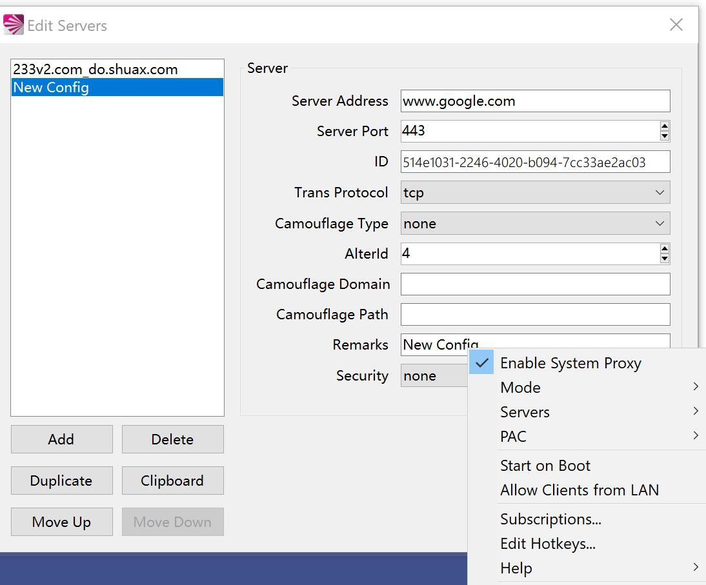

V2RayShell
==============================

## 这是个啥

这是一个 [V2RayCore](https://github.com/v2ray/v2ray-core) 的外壳程序

虽然是V2Ray扩展，但是UI更加偏向于 shadowsocks-windows （界面及使用习惯几乎一模一样）

虽然很简单但是能够满足日常基本需求，也算是小巧玲珑(600KB) 😜

作为一个面向复制粘贴程序员，我可以很负责地说这是一个面向复制粘贴的软体

综上所述，“大神”们请无视本仓库，谢谢

## 和同类软件相比，有哪些不一样？

- 精简掉了统计功能（对我来说几乎用不上）
- 舍弃了精美UI（对我来说用不上）
- 各种围绕V2Ray的扩展（例如使用Grpc框架与V2RayCore进行通信、对vmess以外的协议支持等）
- 去掉了对ipv6的支持（对我来说用不上）
- 使用pac对系统网络进行规则访问（与ss-win保持一致）
- 加入了一些常用快捷键（与ss-win保持一致）

从这几点不难看出：对于我来说，我不需要去随时盯着流量图表来科学使用我仅有的几个节点，我也不想随身携带一个动辄几十M的软件包到处跑，我只需要一个能安安静静躺在后台为我提供服务的工具。

## 如果你对本程序精简掉的功能不满意？

没关系， [这里](https://www.v2ray.com/awesome/tools.html) 有一大堆功能完善的工具可供选择 🤞
